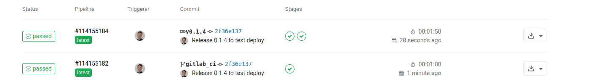
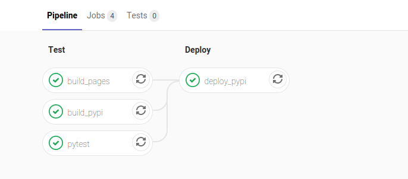

Contribution guide
==================

Information on how to make contributions to the tsfpga project.

Setting up development environment
----------------------------------

For tsfpga development we have a lot more python dependencies than when simply using the package.
Install further dependencies with:

.. code-block:: shell

    python -m pip install --upgrade --requirement requirements_develop.txt

You also need VUnit installed `somewhere where python can find it <https://vunit.github.io/installing.html>`__.

.. _maintain_changelog:

Maintaining changelog
---------------------

We maintain a changelog according to the `keep a changelog <https://keepachangelog.com/>`__ format.
The unreleased changelog in ``doc/release_notes/unreleased.rst`` shall be updated continuously, not just at release.
Release note files are in the ``rst`` format, inspect older release note files to see the formatting details.

How to build documentation
--------------------------

Documentation is built using the ``tools/build_sphinx_docs.py`` script.
The documentation pages have information about unit test code coverage.
So before building documentation you must run pytest with coverage reports enabled like in CI:

.. code-block:: shell

    python -m pytest -v --cov tsfpga --cov-report xml:generated/python_coverage.xml --cov-report html:generated/python_coverage_html tsfpga

You must also run ``simulate.py`` with GHDL and the GCC backend, which supports coverage, before building the documentation.
No extra flags are needed, the script will generate coverage when possible in the correct location.

If want to skip handling of coverage for the documentation there is a flag available in the script, see ``build_sphinx_doc.py --help``.

How to make a new release
-------------------------

Releases are made to the Python Packaging Index (PyPI) and can be installed with the python ``pip`` tool.
To make a new release follow these steps.

Test CI pipeline
________________

Before doing anything, launch a CI run from master to see that everything works as expected.
The CI environment is stable but due to things like, e.g., new pylint version it can unexpectedly break.
When the pipeline has finished and is green you can move on to the next step.

Determine new version number
____________________________

We use the `Semantic Versioning <https://semver.org/>`__ scheme for tsfpga.
Read the **Summary** at the top of that page and decide the new version number accordingly.

Review the release notes
________________________

Check the release notes file ``unreleased.rst``.
Fill in anything that is missing according to :ref:`Maintaining changelog <maintain_changelog>`.

Run release script
__________________

Run the script

.. code-block:: shell

    python3 tools/release.py X.Y.Z

where X.Y.Z is your new version number.
The script will bump the tsfpga version number and copy release notes to a new file.
The changes will be commited and then tagged.

Push commit and tag
___________________

.. code-block:: shell

    git push origin --tag vX.Y.Z HEAD:release_branch

Pushing a tag will create a special CI run in gitlab:

The pipeline for the tag will run an additional job ``deploy_pypi``:

The package is uploaded to https://pypi.org/project/tsfpga/.
If you really want to make sure that everything has worked you can check there and see that your new release is available.

Merge
_____

If everything went well then you can merge your release commit to master.
